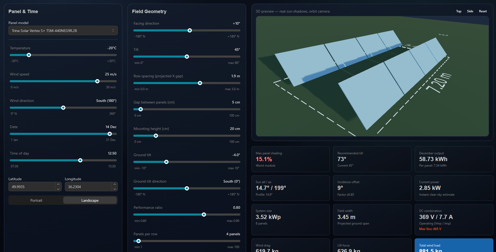

# SolarPowerPlantCalculator

A sophisticated React 19 application for planning and simulating ground-mounted solar panel fields. Designed for engineers and solar enthusiasts, it provides real-time 3D visualization, precise shading analysis, and data-driven yield estimation.



## 🌟 Key Features

### 📐 Precision Shading Analysis
*   **Profile Angle Method:** High-accuracy 2D cross-section shading calculations.
*   **Real-time Shadows:** Watch as inter-row shading changes based on time, date, and panel tilt.
*   **Ground Slope Support:** Calculate yield on uneven terrain with ground tilt and azimuth controls.

### 🔌 Electrical & Mechanical Simulation
*   **Dynamic DC Combination:** Instant Vmp/Imp and Voc calculation based on shading and temperature.
*   **Wind Load Modeling:** Eurocode-inspired wind drag and uplift force estimation.
*   **Temperature Effects:** Voltage adjustment based on standard silicon temperature coefficients.

### 🌍 Data-Driven Yield
*   **Open-Meteo Integration:** Fetch historical irradiance data for precise monthly production estimates.
*   **Clear-Sky Fallback:** Robust mathematical model for times when API data is unavailable.
*   **Sun Geometry:** Precise solar position tracking via SunCalc.

### 🎮 Immersive 3D Experience
*   **Interactive 3D Field:** Built with `@react-three/fiber` and `@react-three/drei`.
*   **Camera Presets:** Quickly switch between Top, Side, and Orbit views.
*   **Dark Theme:** Forced dark aesthetic using Mantine v8 for maximum clarity.

## 🛠️ Tech Stack

- **Frontend:** React 19, TypeScript 5.9, Vite 7
- **UI Framework:** Mantine v8 (Full Viewport Layout)
- **3D Engine:** Three.js, R3F, Drei
- **Math & Science:** SunCalc, Vitest (16+ Math Verification Tests)
- **Data APIs:** Open-Meteo (Weather & Irradiance)

## 🚀 Getting Started

### Prerequisites
- Node.js (Latest LTS recommended)
- npm or yarn

### Installation
1.  **Clone the repository**
    ```bash
    git clone https://github.com/your-username/SolarPowerPlantCalculator.git
    cd SolarPowerPlantCalculator
    ```
2.  **Install dependencies**
    ```bash
    npm install
    ```
3.  **Run the development server**
    ```bash
    npm run dev
    ```

## 🏗️ Architecture Notes

The project follows a **Math-First** approach. All core logic in `src/utils/` (shading, solar geometry, electrical combined) is decoupled from the visualization. The 3D scene is a reactive observer of the mathematical state, ensuring that what you see in the 3D field is physically accurate.

- **Coordinate System:** ENU (East-North-Up)
- **Orientation Mapping:** Compass-based azimuth (0 = South, +90 = West)
- **Tests:** Extensive unit testing via Vitest for all shading edge cases.

## 📄 License

This project is licensed under the MIT License - see the LICENSE file for details.

---
*Created for the future of renewable energy planning.*
